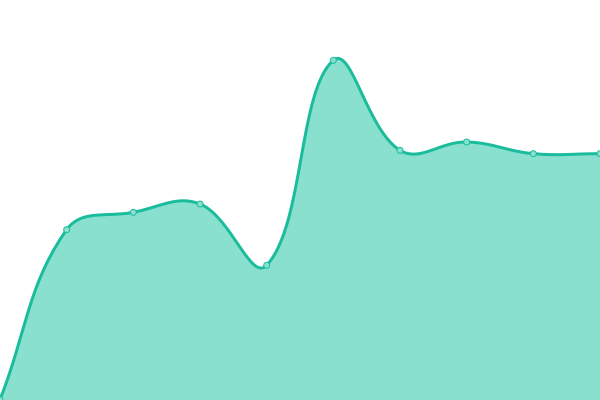

# [📈 Live Status](https://upptime.cognitive.id): <!--live status--> **🟩 All systems operational**

This repository contains the open-source uptime monitor and status page for [Cognitive](https://code.cognitive.id/), powered by [Upptime](https://github.com/upptime/upptime).

With [Upptime](https://upptime.js.org), you can get your own unlimited and free uptime monitor and status page, powered entirely by a GitHub repository. We use [Issues](https://github.com/cgntv/upptime/issues) as incident reports, [Actions](https://github.com/cgntv/upptime/actions) as uptime monitors, and [Pages](https://upptime.cognitive.id) for the status page.

<!--start: status pages-->
<!-- This summary is generated by Upptime (https://github.com/upptime/upptime) -->
<!-- Do not edit this manually, your changes will be overwritten -->
<!-- prettier-ignore -->
| URL | Status | History | Response Time | Uptime |
| --- | ------ | ------- | ------------- | ------ |
|  [Capen Tj.Makmur API](https://denus-capen-api.client.cognitive.id/) | 🟩 Up | [capen-tj-makmur-api.yml](https://github.com/cgntv/upptime/commits/HEAD/history/capen-tj-makmur-api.yml) | 

 1177ms
     
 | 

<a href="https://upptime.cognitive.id/history/capen-tj-makmur-api">99.60%</a>
    

|  [Sewa Jas Jogja](https://sewajasjogja.com/) | 🟩 Up | [sewa-jas-jogja.yml](https://github.com/cgntv/upptime/commits/HEAD/history/sewa-jas-jogja.yml) | 

 584ms
     
 | 

<a href="https://upptime.cognitive.id/history/sewa-jas-jogja">100.00%</a>
    

|  [Lava Tour Merapi Adventure](https://lavatourmerapi-adv.online/) | 🟩 Up | [lava-tour-merapi-adventure.yml](https://github.com/cgntv/upptime/commits/HEAD/history/lava-tour-merapi-adventure.yml) | 

 3702ms
     
 | 

<a href="https://upptime.cognitive.id/history/lava-tour-merapi-adventure">99.76%</a>
    

|  [Mocca Thrift.](https://mocca.gq/) | 🟩 Up | [mocca-thrift.yml](https://github.com/cgntv/upptime/commits/HEAD/history/mocca-thrift.yml) | 

 7732ms
     
 | 

<a href="https://upptime.cognitive.id/history/mocca-thrift">98.20%</a>
    

<!--end: status pages-->

[**Visit our status website →**](https://upptime.cognitive.id)

## 📄 License

- Powered by: [Upptime](https://github.com/upptime/upptime)
- Code: [MIT](./LICENSE) © [Cognitive](https://code.cognitive.id/)
- Data in the `./history` directory: [Open Database License](https://opendatacommons.org/licenses/odbl/1-0/)
